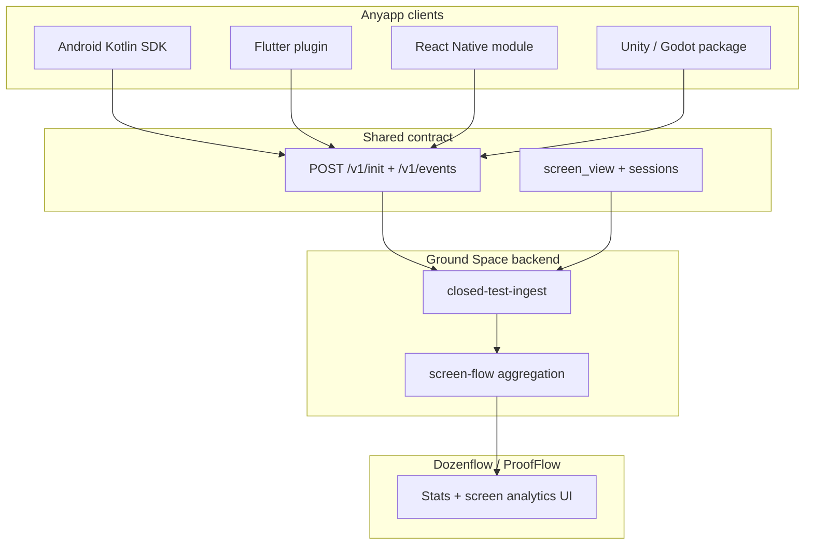

# Кросс-платформенный граф экранов (screen graph)

**Статус:** architecture draft  
**Связано:** [`spec.md`](../spec.md) (`screen_view`), [`openapi/ingest.yaml`](../openapi/ingest.yaml), [`docs/SDK_USAGE.md`](SDK_USAGE.md), модуль `closed-test-sdk-navigation-compose`, ProofFlow [`SCREEN_FLOW_ANALYTICS_DRAFT.md`](../../ProofFlow/docs/SCREEN_FLOW_ANALYTICS_DRAFT.md).

---

## 1. Задача

Организатор закрытого теста хочет видеть **граф навигации** anyapp: какие экраны/сцены открывали тестеры и сколько времени там провели — независимо от того, на чём собрано приложение:

- Android (Views, Compose, Navigation)
- Flutter
- React Native
- игровые движки (Unity, Godot, Unreal, …)

**Ключевая идея:** сервер и ProofFlow **не знают** Flutter/Unity. Они работают с **единым потоком событий ingest**. Платформа — только метаданные и способ доставки `screen_view`.

---

## 2. Архитектура (слои)



| Слой | Ответственность |
|------|-----------------|
| **Контракт ingest** | Одинаковые `type`, обязательные поля, PII-политика |
| **SDK / bridge на стек** | init, очередь, batch, lifecycle, `trackScreen` / auto-hooks |
| **Конвенция имён** | Стабильные `screen_name`, без user id в route |
| **Screen graph manifest** (опционально) | Ожидаемые узлы и воронки для организатора |
| **Сервер** | Хранение событий, dwell time, reach, funnels |
| **ProofFlow** | Отображение агрегатов и per-tester детализации |

---

## 3. Что уже есть (Android)

| Компонент | Статус |
|-----------|--------|
| Событие `screen_view` + `screen_name` | ✅ `spec.md` §4 |
| `ClosedTest.trackScreen(name)` | ✅ core SDK |
| Приём и persist на сервере | ✅ `closed_test_ingest_events` |
| Авто-трекинг Navigation Compose | ✅ артефакт `closed-test-sdk-navigation-compose` |
| Агрегация графа в ProofFlow | 📋 черновик `SCREEN_FLOW_ANALYTICS_DRAFT.md` |
| Flutter / RN / Unity | ❌ нет клиента ingest |

Сегодня `os` в init/events — **`android` only** (`openapi/ingest.yaml`). Кросс-платформа начинается с расширения контракта, не с «универсальной библиотеки UI».

---

## 4. Единый контракт (протокол)

### 4.1. Узел графа = `screen_view`

Минимум для любого стека:

```json
{
  "type": "screen_view",
  "screen_name": "inventory",
  "occurred_at": "2026-05-31T12:00:00Z",
  "monotonic_ms": 12345678,
  "device_id": "550e8400-e29b-41d4-a716-446655440000",
  "sdk_version": "0.2.13",
  "app_version": "1.4.0",
  "os": "android",
  "os_version": "14",
  "event_id": "…",
  "session_id": "…"
}
```

Переходы **A → B** и dwell time на сервере выводятся из порядка `screen_view` и пар `session_*` / `app_foreground` / `app_background` (см. ProofFlow draft §5).

### 4.2. Предлагаемые расширения (обратно совместимые)

Добавить **опциональные** поля на уровне события (и/или init):

| Поле | Тип | Назначение |
|------|-----|------------|
| `runtime` | string enum | Кто сгенерировал событие: см. §4.3 |
| `runtime_version` | string | Версия Flutter / RN / Unity runtime |
| `screen_path` | string | Технический путь: `/settings`, `Scene:Menu`, deep link slug |
| `graph_version` | string | Версия manifest графа от разработчика (`"1"`, `"2026-05-01"`) |
| `previous_screen_name` | string | Явный переход (если клиент знает; иначе сервер выводит сам) |

**vNext тип события** (точнее dwell без эвристик):

```json
{
  "type": "screen_leave",
  "screen_name": "inventory",
  "duration_ms": 42000
}
```

### 4.3. Enum `runtime` (черновик)

```
android_native
android_compose
android_fragment
flutter
react_native
unity
godot
unreal
web
custom
```

### 4.4. Расширение `os` в init (черновик OpenAPI)

Сейчас:

```yaml
os:
  type: string
  enum: [android]
```

Предложение (фаза B — iOS / кросс-платформа):

```yaml
os:
  type: string
  enum: [android, ios]
  description: Host OS. Cross-platform frameworks still report host OS here.
```

Для **единого** Flutter/RN билда на Android+iOS — два ingest-клиента с одним `package_name` / bundle id политикой; детали Base/Advanced для iOS — отдельное решение продукта.

### 4.5. Игры: сцена ≠ UI-экран

Для движков узлом графа часто является **сцена** или **игровое состояние**:

| Подход | Пример `screen_name` | Когда |
|--------|----------------------|--------|
| Сцена | `scene_main_menu`, `scene_level_03` | Unity `SceneManager.sceneLoaded` |
| Состояние внутри сцены | `combat`, `pause_menu` | `trackScreen` / `track_event` вручную |
| UI overlay | `shop_dialog` | отдельный overlay поверх gameplay |

Рекомендация: **сцена через auto-hook, UI-состояния — вручную**; в manifest графа организатор помечает «ключевые» узлы.

---

## 5. Адаптеры по технологиям

Один fat-SDK со всеми движками **не делаем** (см. `navigation-compose` как opt-in). Матрица:

| Стек | Артефакт (целевой) | Автотрекинг | Ручной fallback |
|------|-------------------|-------------|-----------------|
| **Android Kotlin** | `closed-test-sdk` | `navigation-compose` | `ClosedTest.trackScreen` |
| **Android Fragments** | `closed-test-sdk-fragment` (planned) | `FragmentManager` callbacks | `trackScreen` |
| **Flutter** | `closed_test_sdk` (pub) | `NavigatorObserver` / `go_router` | `ClosedTest.trackScreen` (Dart API) |
| **React Native** | `@groundspaceteam/closed-test-sdk` | `NavigationContainer` `onStateChange` | JS `trackScreen` |
| **Unity** | `ClosedTestSDK` (UPM / .unitypackage) | `SceneManager.sceneLoaded` | C# `TrackScreen` |
| **Godot** | GDExtension / autoload | `tree.current_scene_changed` | `track_screen()` |
| **Unreal** | plugin module | `UGameplayStatics::OpenLevel` hook | Blueprint/C++ call |

Каждый адаптер обязан:

1. Реализовать **тот же handshake** (`/v1/init`, refresh, `/v1/events`).
2. Использовать **стабильный `device_id`** на установку (правила per-OS).
3. Пробрасывать **lifecycle** (foreground/background, sessions) или документировать ограничения.
4. Мапить навигацию → **`screen_name`** по правилам §6.
5. Выставлять `runtime` для фильтрации в поддержке.

### 5.1. Flutter (эскиз)

```dart
class ClosedTestNavigatorObserver extends NavigatorObserver {
  @override
  void didPush(Route route, Route? previousRoute) {
    final name = route.settings.name ?? route.runtimeType.toString();
    ClosedTest.trackScreen(ClosedTestNavScreenNames.fromRoute(name));
  }
}
```

### 5.2. React Native (эскиз)

```javascript
<NavigationContainer
  onStateChange={() => {
    const route = navigationRef.getCurrentRoute();
    if (route?.name) ClosedTest.trackScreen(route.name);
  }}
>
```

### 5.3. Unity (эскиз)

```csharp
void OnEnable() => SceneManager.sceneLoaded += OnSceneLoaded;
void OnSceneLoaded(Scene scene, LoadSceneMode mode) =>
    ClosedTest.TrackScreen($"scene_{scene.name}");
```

---

## 6. Конвенция имён (`screen_name`)

Обязательно для **всех** стеков (иначе сводный граф бессмысленен):

1. **Snake_case или kebab-case**, латиница: `checkout`, `level_select`.
2. **Стабильность** между сборками closed test.
3. **Без PII** — не `user_ivan`, не email (`spec.md` §8).
4. **Без сырых id в path** — маршрут `profile/12345` → клиент шлёт `profile`, не `profile/12345`.
5. **Один словарь на продукт** — RN `SettingsScreen` и Android `settings` должны сойтись в одно имя `settings`.

Опционально: файл **`closed_test_screens.yaml`** в репозитории anyapp (рядом с кодом), синхронизируется с manifest в ProofFlow (фаза F).

---

## 7. Screen graph manifest (опционально)

Чтобы организатор видел **воронки**, а не только топ экранов:

```yaml
# closed_test_screens.yaml
graph_version: "1"
screens:
  - id: splash
    label: Splash
  - id: home
    label: Home
  - id: play
    label: First match
funnels:
  - id: first_session
    steps: [splash, home, play]
```

| Где хранить | Плюсы |
|-------------|--------|
| Репозиторий anyapp | версионируется с кодом |
| Карточка теста ProofFlow | организатор правит без релиза |
| Оба + `graph_version` в событиях | сверка «код vs ожидания» |

API ProofFlow (черновик): `PUT /me/tests/:id/screen-graph` + отдача в analytics для % прохождения funnel.

---

## 8. Сервер (AndroidServer)

### Уже есть

- Persist `screen_view` → `closed_test_ingest_events`
- Session aggregation для кворума

### Нужно для screen graph (см. ProofFlow draft)

- `screen-flow-stats.util.ts` — dwell, transitions, reach
- `GET /api/proofflow/v1/me/tests/:testId/screen-analytics`
- Фильтр по `campaign_epoch_at`, UTC day
- Опционально колонка/JSON `runtime` в events при persist

Сервер **не парсит** Flutter/Unity — только события.

---

## 9. ProofFlow (организатор)

- Блок на Stats: топ экранов, reach.
- Session details: экраны per device/day.
- Empty state: «Подключите SDK / bridge и вызывайте trackScreen» + ссылка на Site docs.
- Два уровня видимости: агрегат без ProofFlow у тестера vs детализация с bind.

---

## 10. Roadmap

| Фаза | Deliverable |
|------|-------------|
| **A** | Этот документ + согласование полей §4.2 с `spec.md` / OpenAPI |
| **B** | Android: Fragment helper; server screen analytics MVP |
| **C** | Flutter plugin (Android host first) |
| **D** | React Native module |
| **E** | Unity package |
| **F** | Screen graph manifest + funnels в ProofFlow |
| **G** | iOS ingest client + `os: ios` |
| **H** | `screen_leave` в spec + SDK |

---

## 11. Анти-паттерны

| Не делать | Почему |
|-----------|--------|
| Один AAR/npm со всеми движками | раздувает зависимости, ломает версии |
| Парсить исходники на сервере | хрупко, не отражает runtime |
| Разные `screen_name` на платформах без словаря | граф не склеится |
| Класть user id в route без sanitization | PII, нарушение §8 |

---

## 12. Связанные файлы

| Репозиторий | Путь |
|-------------|------|
| SDK | `closed-test-sdk/`, `closed-test-sdk-navigation-compose/` |
| Контракт | `spec.md`, `openapi/ingest.yaml` |
| Доки интеграции | `docs/SDK_USAGE.md` |
| Продукт | `ProofFlow/docs/SCREEN_FLOW_ANALYTICS_DRAFT.md` |
| Сервер | `AndroidServer/.../ingest-event-persister.service.ts`, `ingest-stats.util.ts` |

---

*Черновик. Изменения OpenAPI и новые поля событий — только после явного решения и версии SDK/ingest.*
